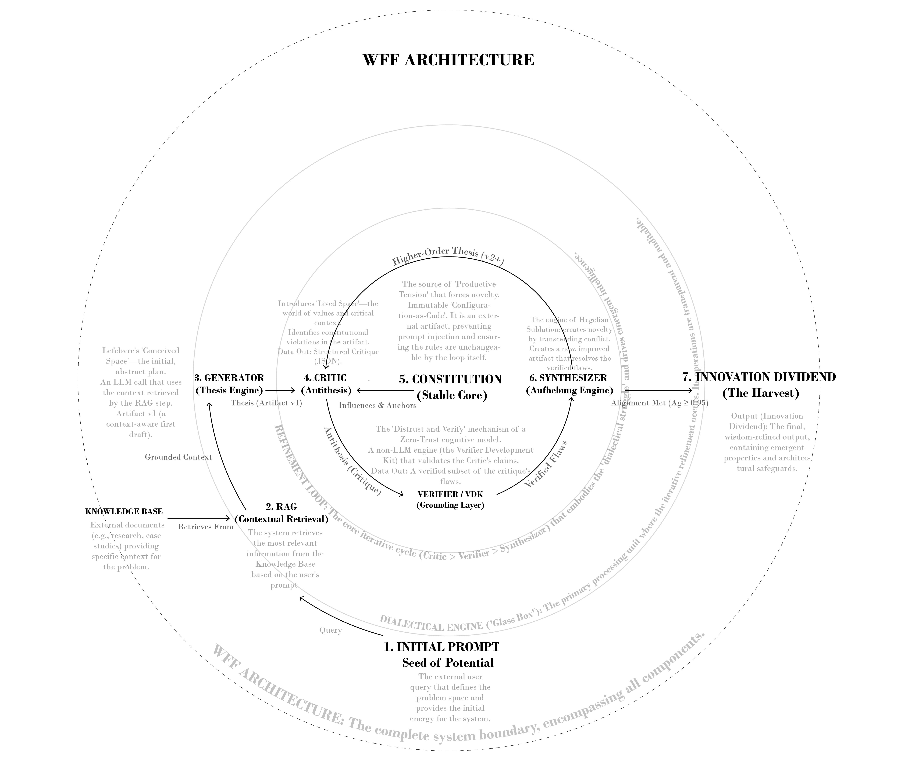

# The Wisdom Forcing Function

## Reframing AI Alignment from Constraint to Catalyst

**Author:** Carlos Arleo | Architect & Urban Researcher
**Institution:** The Regenerative Development Initiative
**Contact:** c.arleo@localis-ai.uk
**Status:** Research Prototype - Seeking Collaborators

---

## What is this?

The **Wisdom Forcing Function (WFF)** is a dialectical AI architecture that treats alignment not as a constraint to minimize harm, but as a catalyst to generate wisdom. By using tension-rich constitutions as a forcing function, the system produces novel governance solutions through structured cognitive conflict.

**Core thesis:** The "alignment tax" (the idea that safety reduces capability) is an artifact of limited design. When alignment is architected as productive tension rather than restrictive rules, it becomes an engine for innovation—what we call the "innovation dividend."

### The Architecture

The WFF operates through a **Zero-Trust Cognitive Loop:**

1. **Constitution Loading** — Tension-rich principles guide all reasoning
2. **RAG-Enhanced Generation** — Context-grounded proposals (Generator)
3. **Critical Analysis** — Constitutional and strategic critique (Critic)
4. **Programmatic Verification** — Non-LLM fact-checking of critiques (VDK Verifier)
5. **Dialectical Synthesis** — Higher-order solutions resolving verified tensions (Synthesizer)
6. **Iteration** — Process repeats until constitutional coherence achieved
7. **Glass Box Audit Trail** — Every step logged for transparency



---

## Why it matters

Current AI alignment focuses primarily on preventing harm through constraint optimization. This is necessary but insufficient for addressing complex, systemic challenges. The WFF explores whether alignment can be designed to:

- **Generate novel solutions** to problems beyond its training data
- **Self-correct through dialectical struggle** rather than just following rules
- **Produce auditable reasoning** that humans can inspect and trust
- **Scale democratically** by enabling communities to co-design their own AI constitutions

This approach synthesizes insights from:

- **Dialectical Systems** (Henri Lefebvre) — Productive tension in social space
- **Regenerative Design** (Bill Reed, Janine Benyus) — Cultivating potential, not just minimizing harm
- **Critical Theory** (Habermas, Foucault) — Power-aware, democratically-oriented technology

---

## Key Findings

### 1. The Innovation Dividend

Across multiple experiments, the WFF has autonomously synthesized novel governance architectures, including:

- **Self-enforcing accountability mechanisms** with "dead man's switch" protocols
- **Anti-capture democratic designs** with nested verification loops
- **Living treaties** with ecological ratchet principles
- **Meta-ethical principles** like "Liberatory Intervention" to resolve constitutional paradoxes

**See:** [Table 1 in the paper](docs/WFF_Paper.pdf) for novelty assessments

### 2. Iteration is Necessary

A deep-dive case study (the "Interrogation Protocol") demonstrates that a single pass with a good constitution produces good first drafts, but **the most resilient, anti-fragile components emerge only through iterative dialectical struggle.**

Over 10 iterations, the system:

- Identified voluntary enforcement vulnerabilities → invented Political Praxis principle
- Recognized meta-cognitive risks → created Autonomous Dissemination architecture
- Self-hardened through architectural invention

**See:** [Interrogation Protocol analysis](docs/case-studies/experiments/) for the full trace

### 3. The Genesis Protocol

The WFF solved its own primary limitation (the "Expert Bottleneck" of requiring human-written constitutions) by generating a complete methodology for communities to co-design their own constitutions:

- **Tension Finder Workshop** — Surface lived tensions from community history
- **Principle Derivation Framework** — Translate tensions into operational principles
- **Dialectical IDE Concept** — Interactive tool for constitutional red-teaming

This reframes the AI's role from oracle (providing answers) to facilitator (providing process).

**See:** [Genesis Protocol case study](docs/case-studies/experiments/)

### 4. Constitutional Guidance is Powerful

A comparative experiment ("The Tale of Three AIs") shows that even a single pass with a tension-rich constitution dramatically improves strategic quality compared to an unconstrained baseline.

**See:** [The Tale of Three AIs](docs/case-studies/The%20Tale%20of%20Three%20AIs/)

---

## Current Limitations

This is early-stage research. Key limitations include:

- **Limited baseline comparisons** — Deep-dive case studies need rigorous A/B testing
- **Novelty claims need external validation** — Independent experts should assess synthesized architectures
- **Computational cost** — Iteration is expensive; optimization needed for production use
- **Self-assessment bias** — Author-evaluated novelty scores (0-5 scale) need blind external review

**These limitations are why I'm seeking collaborators.** I believe this approach has potential, but it needs rigorous, independent validation.

---

## Read More

- 📄 **[Full Paper](docs/WFF_Paper.pdf)** — Theoretical framework, architecture details, experimental results
- 📖 **[Project Overview](docs/01_project_overview.md)** — Quick conceptual introduction
- 🧭 **[Constitutional Philosophy](docs/02_constitution_philosophy.md)** — The principles that guide the system
- 🔬 **[Case Studies](docs/case-studies/)** — Detailed experiments and analyses
- ⭐ **[The Tale of Three AIs](docs/case-studies/The%20Tale%20of%20Three%20AIs/)** — Comparative demonstration of constitutional power

---

## Get Involved

I'm actively seeking collaborators for validation and development. Specifically looking for:

### Research Partners

- **AI safety researchers** — To rigorously test against baselines and validate novelty claims
- **Constitutional AI researchers** — To explore extensions and integrations with existing work
- **Critical AI scholars** — To strengthen the power-aware, democratic design

### Practitioners

- **Participatory governance practitioners** — To pilot the Genesis Protocol with real communities
- **DAO/cooperative organizers** — To test constitutional co-design methodologies
- **Regenerative design practitioners** — To validate the operationalization of regenerative principles

### Technical Collaborators

- **ML engineers** — To optimize the architecture for production use
- **Verification specialists** — To strengthen the VDK and audit trail systems

### Institutional/Funding Partners

- **Research institutions** — For academic validation and funding access
- **Foundations** — Focused on democratic tech, AI governance, or regenerative systems

---

## How to Contribute

1. **Read** the [paper](docs/WFF_Paper.pdf) and explore [case studies](docs/case-studies/)
2. **Open an issue** to share thoughts, critiques, or identify opportunities
3. **Email me directly** at c.arleo@localis-ai.uk to discuss collaboration
4. **See** [CONTRIBUTING.md](CONTRIBUTING.md) for more detailed guidance

I'm committed to open, transparent research and shared credit. If you're interested in exploring these ideas together, let's talk.

---

## Citation

If you reference or build upon this work:

```bibtex
@misc{arleo2025wff,
  author = {Arleo, Carlos},
  title = {From Urban Ecology to AI Alignment: The Wisdom Forcing Function as an Innovation Dividend},
  year = {2025},
  institution = {The Regenerative Development Initiative},
  url = {https://github.com/[your-username]/Living-Systems-Data-Room}
}
```
